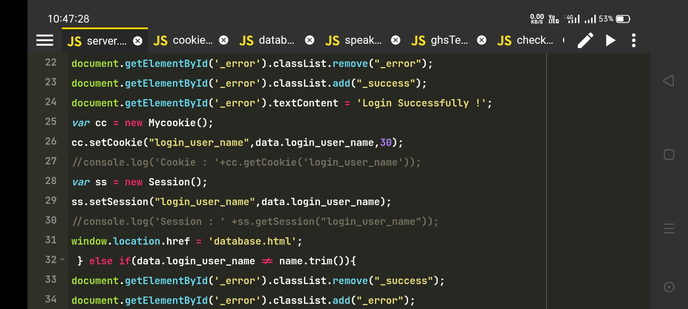
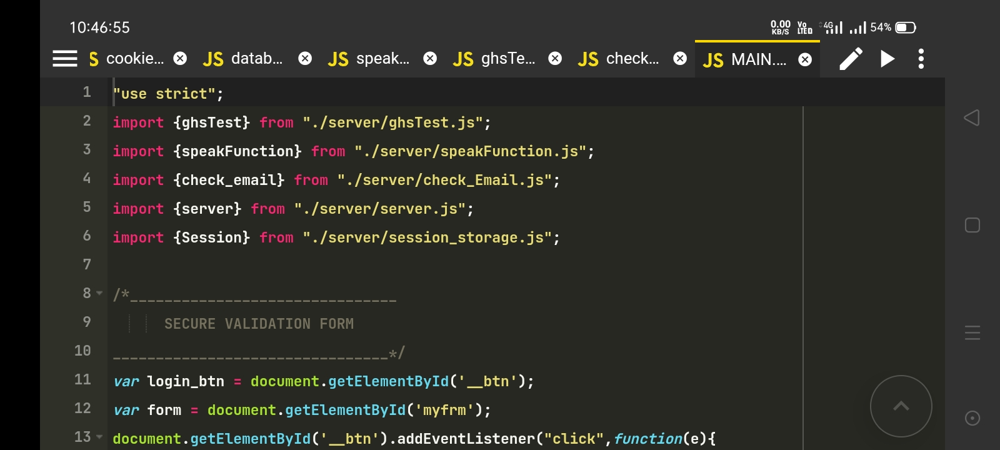
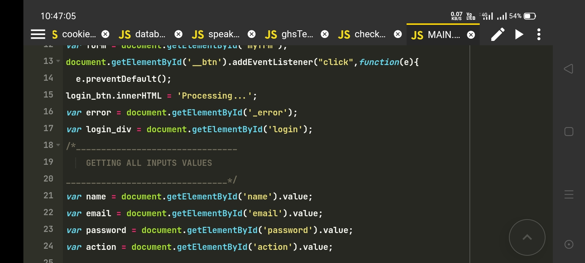
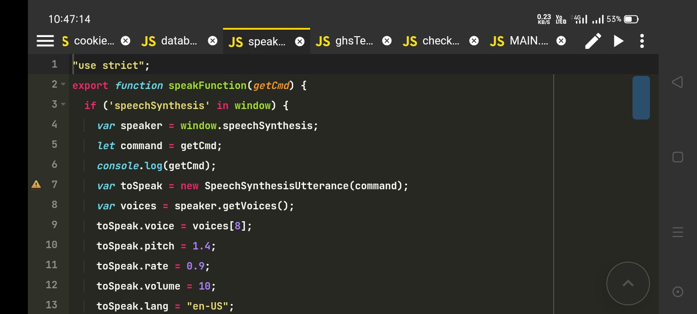
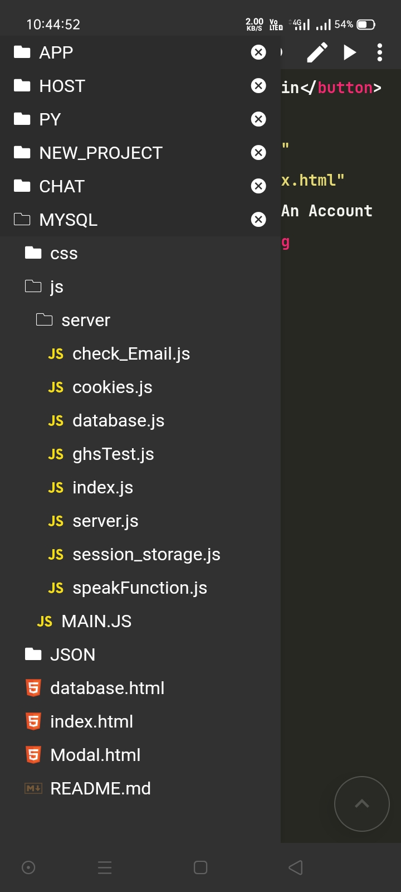
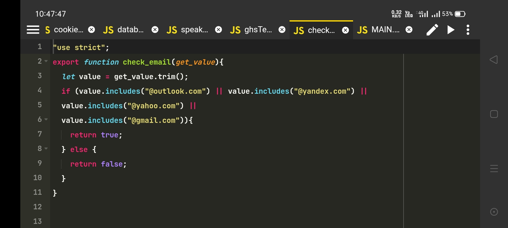
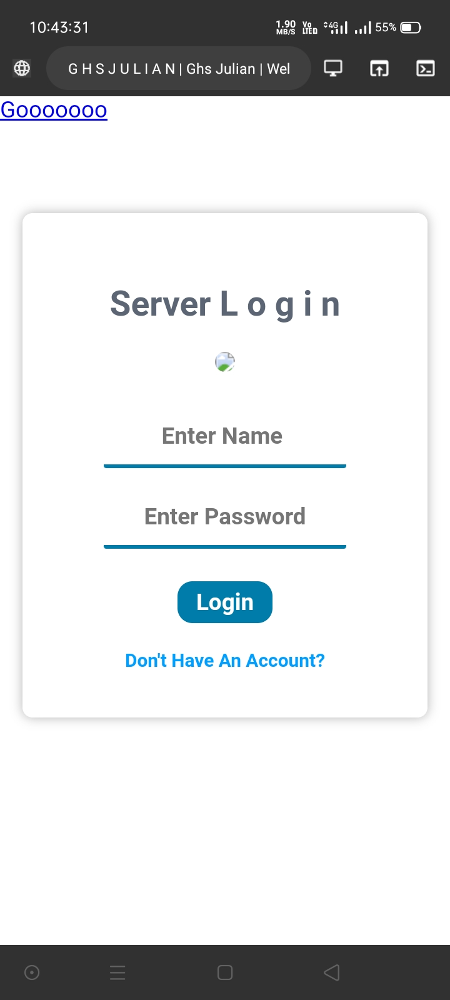
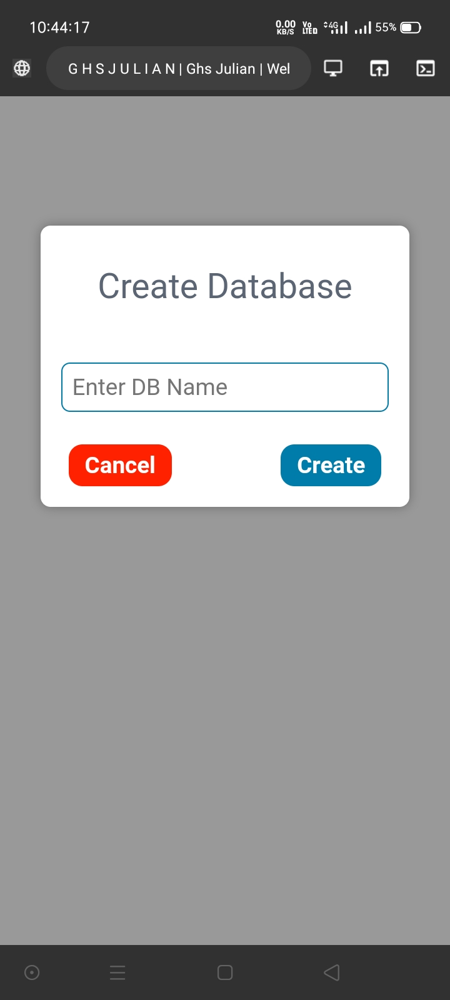

## Web Devoloper Ghs Julian


DEMO : -------👇

https://ghsjulian.github.io/login_without_database/


 ##### Hello Dear This Is My New Project . It Is A An Awesome Login Project Using Advance Javascript ES6 Version And JSON . You Don't Need Use The PhpMyAdmin . I'v Used Only Javascript . Specially I Used The LocalStorage , Cookies , And Session Storage !
 
 ## Languages And Tools :
 ```
 [ 1 ] HTML5 
 [ 2 ] CSS3
 [ 3 ] Javascript ES6
 [ 4 ] JSON Data
 [ 5 ] Browser Cookies
 [ 6 ] Browser Session
 [ 7 ] Local Storage
 ```
## How To Use :
```
(*) Download This project And Extact This ZIP File 
(*) Open The Index.html File Inside Your Browser .
(*) You See An Awesome Login Page Infront Of You .
(*) Now Login In It !
(*) The User Name And Password Is Given Bellow.
(*) User Name : "Ghs Julian"
(*) User Password : "root"
(*) If The Login User Name And Password Is Correct .
(*) You Can See The Another HTML File Name database .
(*) Now Click The Open Popup Button , You Can See A Awesome Popup Modal Box .
(*) There Is'nt Any Back End Method . Just For Styling !
```
## Demo And Screenshots : 










